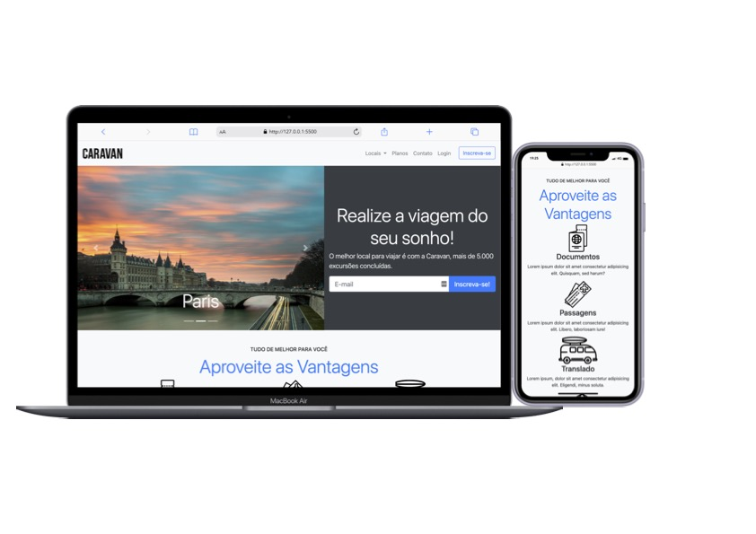

# :airplane: Caravan Viagens

  
   
  
Acesse o projeto <a href="https://wspietro.github.io/canva-viagens-bootstrap/">Aqui!</a>

---

## 💻 Tecnologias Utilizads

Durante o projeto, foram utilizadas as seguintes tecnologias: 
 - [BOOTSTRAP 4](https://getbootstrap.com/docs/4.1/getting-started/introduction/)
 - [CSS](https://www.w3.org/Style/CSS/)
 - [HTML](https://developer.mozilla.org/pt-BR/docs/Web/HTML)

 ## ☕ Sobre
Esse projeto foi desenvolvido através de materiais fornecidos pela escola [Origamid](https://www.origamid.com/curso/bootstrap-4/), com o objetivo de praticar e me desenvolver com a documentação do Bootstrap.

O site utiliza os principais componentes disponíveis pela ferramenta, construindo páginas para uma agência de viagens.

## :iphone: Funcionalidades:
Todo o projeto é responsivo para aparelhos móveis e tablets, responsividade feita através do Bootstrap.

## 🤝 Colaboradores

<table>
  <tr>
    <td align="center">
      <a href="https://github.com/wspietro">
         
        
          <b>Pietro Sera</b>
        
      </a>
  </tr>
</table>

 
 

